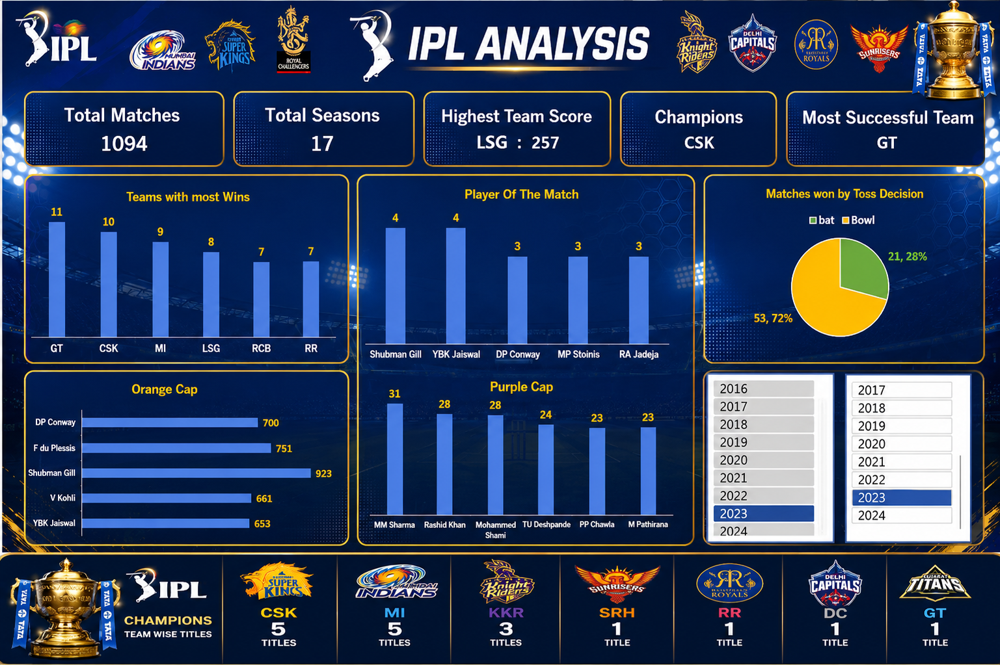
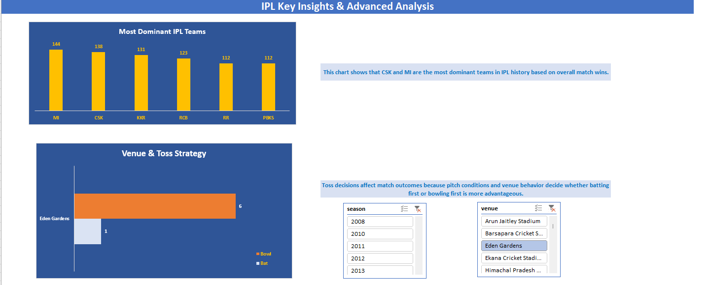
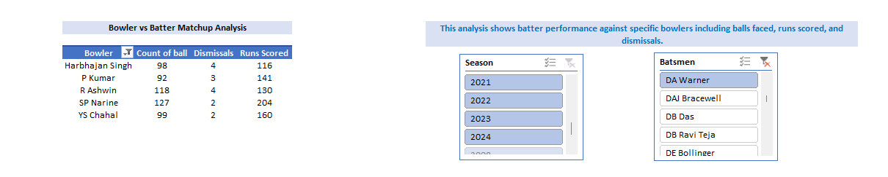

# IPL Data Analysis Dashboard using Excel (2008–2024)

## Project Overview

This project is an interactive IPL Analysis Dashboard built in Microsoft Excel using IPL datasets from 2008 to 2024. The dashboard provides insights into team performance, player statistics, venue analysis, toss decisions, and batting-bowling matchups.

The project focuses on data cleaning, data standardization, interactive dashboard creation, and sports analytics using Excel.

---

## Tools & Features Used

* Microsoft Excel
* Pivot Tables
* Pivot Charts
* Slicers
* XLOOKUP
* Data Cleaning
* Conditional Formatting
* Interactive Dashboard Design

---

## Project Highlights

✔ Interactive Excel Dashboard
✔ IPL Dataset (2008–2024)
✔ Data Cleaning & Transformation
✔ Dynamic Slicers & KPIs
✔ Player & Team Performance Analysis
✔ Venue & Toss Decision Insights
✔ Bowler vs Batsman Matchup Analysis

---

## Key Insights

* Most dominant IPL teams based on wins
* Orange Cap and Purple Cap analysis
* Strike rate and economy rate comparison
* Venue and toss decision analysis
* Team qualification, finals, and title analysis
* Player of the Match trends
* Bowler vs Batsman matchup analysis
* Highest team scores by season
* IPL champions analysis using slicers

---

## Data Cleaning & Transformation

Performed extensive data cleaning and standardization to improve consistency across datasets:

* Standardized team names:

  * Royal Challengers Bengaluru → Royal Challengers Bangalore
  * Kings XI Punjab → Punjab Kings
  * Rising Pune Supergiants → Rising Pune Supergiant

* Cleaned inconsistent venue names

* Converted season formats:

  * 2007/08 → 2008

* Removed duplicate and inconsistent entries

* Used XLOOKUP to create relationships between datasets for dynamic filtering and slicer interaction

---

## Dashboard Features

* Interactive slicers for season and venue filtering
* Dynamic KPI cards
* Team and player performance analysis
* Matchup analysis between batsmen and bowlers
* Advanced IPL insights and trends visualization

---

## Dashboard Preview

### Main Dashboard

### Advanced Analysis

### Matchup Analysis

---

## Files Included

* IPL Dashboard.xlsx
* IPL Dashboard.png
* advanced-analysis.png
* matchup-analysis.png

---

## Author

Narendra Jogi
